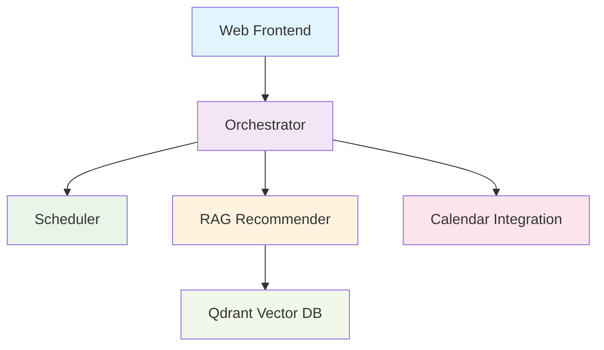

# Docker/Development Parity Guide

This document ensures that services work consistently between Docker and development environments.

## 🔧 Key Changes Made

### 1. Environment Variable Handling

**Problem**: Environment variables were loaded differently in dev vs Docker
**Solution**: 
- Added `DOCKER_ENV=true` flag to all Docker containers
- Updated `next.config.js` to conditionally load environment variables
- Created Docker-specific service URLs in `global.env`

### 2. Service URL Configuration

**Development URLs** (localhost):
```bash
NEXT_PUBLIC_API_URL=http://localhost:8000
NEXT_PUBLIC_SCHEDULER_API_URL=http://localhost:8001
NEXT_PUBLIC_RAG_API_URL=http://localhost:8002
NEXT_PUBLIC_CALENDAR_API_URL=http://localhost:8003
```

**Docker URLs** (container names):
```bash
DOCKER_NEXT_PUBLIC_API_URL=http://orchestrator:8000
DOCKER_NEXT_PUBLIC_SCHEDULER_API_URL=http://scheduler:8001
DOCKER_NEXT_PUBLIC_RAG_API_URL=http://rag-recommender:8002
DOCKER_NEXT_PUBLIC_CALENDAR_API_URL=http://calendar-integration:8003
```

### 3. Dockerfile Improvements

**Web Service (`clients/web/Dockerfile`)**:
- Added `DOCKER_ENV=true` environment variable
- Added curl for health checks
- Fixed environment variable loading path issues

**Python Services** (orchestrator, scheduler, rag-recommender, calendar-integration):
- All use consistent multi-stage builds
- Proper health checks
- Non-root user security
- Shared models package installation

## 🚀 Usage

### Development Mode
```bash
# Start individual services for development
cd clients/web && npm run dev
# Start backend services individually as needed
```

### Docker Mode
```bash
# Start all services with Docker Compose
docker-compose up -d

# Test all services
./test-docker-services.sh

# View logs
docker-compose logs -f [service-name]

# Stop all services
docker-compose down
```

## 🧪 Testing Services

### Automated Testing
Run the provided test script:
```bash
./test-docker-services.sh
```

### Manual Testing
1. **Container Status**: `docker ps`
2. **Service Health**:
   - Orchestrator: http://localhost:8000/health
   - Scheduler: http://localhost:8001/health
   - RAG Recommender: http://localhost:8002/health
   - Calendar Integration: http://localhost:8003/health
   - Qdrant: http://localhost:6333/health
   - Web Frontend: http://localhost:3000

3. **API Endpoints**:
   - http://localhost:8000/api/v1/status
   - http://localhost:3000/api/debug-env (if available)

## 🔍 Troubleshooting

### Common Issues

1. **Services can't communicate in Docker**
   - ✅ Check that all services are on `beq-network`
   - ✅ Use container names (e.g., `orchestrator:8000`) not `localhost`

2. **Environment variables not loaded**
   - ✅ Verify `global.env` is in project root
   - ✅ Check `DOCKER_ENV=true` is set in docker-compose.yml
   - ✅ Restart containers after env changes

3. **Frontend can't reach backend**
   - ✅ Check Next.js config uses correct URLs for Docker
   - ✅ Verify rewrites are working correctly
   - ✅ Check browser console for network errors

4. **Health checks failing**
   - ✅ Ensure curl is installed in containers
   - ✅ Check service is binding to `0.0.0.0` not just `localhost`
   - ✅ Verify correct ports are exposed

### Service Dependencies



## 📋 Configuration Files

### Key Files Modified
- `docker-compose.yml` - Added Docker environment flags
- `clients/web/next.config.js` - Docker-aware environment loading
- `clients/web/Dockerfile` - Added Docker environment flag
- `global.env` - Added Docker-specific service URLs
- All service Dockerfiles - Consistent health checks and security

### Environment Variables

| Variable | Development | Docker |
|----------|-------------|--------|
| `DOCKER_ENV` | `undefined` | `true` |
| `NEXT_PUBLIC_API_URL` | `http://localhost:8000` | `http://orchestrator:8000` |
| `SCHEDULER_SERVICE_URL` | `http://localhost:8001` | `http://scheduler:8001` |
| `RAG_SERVICE_URL` | `http://localhost:8002` | `http://rag-recommender:8002` |
| `CALENDAR_SERVICE_URL` | `http://localhost:8003` | `http://calendar-integration:8003` |

## 🔄 Switching Between Modes

### From Development to Docker
```bash
# Stop any running dev servers
pkill -f "npm run dev"
pkill -f "uvicorn"

# Start Docker services
docker-compose up -d

# Test services
./test-docker-services.sh
```

### From Docker to Development
```bash
# Stop Docker services
docker-compose down

# Start development servers
cd clients/web && npm run dev &
cd services/orchestrator && uvicorn app.main:app --host 0.0.0.0 --port 8000 &
# ... start other services as needed
```

## ✅ Verification Checklist

- [ ] All containers start successfully
- [ ] All health checks pass
- [ ] Web frontend loads at http://localhost:3000
- [ ] API endpoints respond correctly
- [ ] Services can communicate internally
- [ ] Environment variables are loaded correctly
- [ ] Logs show no critical errors
- [ ] Test script passes all checks

## 🔮 Future Improvements

1. **Production Configuration**: Separate Docker compose for production
2. **Environment Detection**: Auto-detect Docker environment
3. **Hot Reloading**: Improve development experience in Docker
4. **Load Balancing**: Add nginx for production deployments
5. **Monitoring**: Add Prometheus/Grafana stack
6. **Secrets Management**: Use Docker secrets for sensitive data
